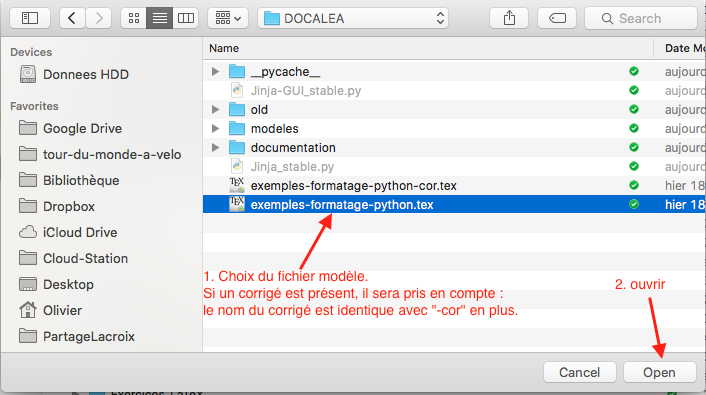
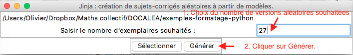

# TexAlea

Après avoir créé un modèle, le professeur de mathématiques pourra obtenir différentes versions de ses exercices avec des données différentes et les corrigés.

## Prérequis

### Sous Windows

* [Python 3](https://www.python.org/downloads/) (à installer _pour tous les utilisateurs_)
* Ouvrir _l'invite de commande_ en tant qu'administrateur (avec Cortana, chercher _cmd_ puis cliquer droit sur _Invite de commandes_ puis _Exécuter en tant qu'administrateur_).
* Installer Jinja2 : dans l'invite de commande taper `cd "C:\Program Files (x86)\Python36-32"` puis `pip3 install Jinja2`.

### Sous Mac Os

* [Python 3](https://www.python.org/downloads/) (à installer)
* Installer Jinja2 : dans un terminal taper `(sudo) pip3 install Jinja2` 

## Création du modèle

Le fichier *.tex* peut contenir du code qui sera interprété par Jinja2

* Bloc : `## Bloc ##`
* Variables et calculs `<< N >>`
* Commande sur une ligne : `%% Commande`
* Commentaire sur plusieurs lignes : `\#{ Commentaire }`
* Commentaire court : `%# Commentaire`

### En-tête

Il ne faut pas écrire `\begin{document}` (ni `\end{document}`), le script va automatiquement insérer : 

```
\documentclass[a4paper,11pt,fleqn]{article}
\input{preambule}
\begin{document}
\pagestyle{empty}
```

Lorsqu'on souhaite personnaliser le fichier LaTeX, on peut écrire, dans le même dossier, un fichier `preambule-perso.tex` qui sera utilisé comme préambule de tous les documents du dossier. On peut aussi créer un préambule personnalisé pour chaque modèle de fichier .tex en ajoutant "-preambule" au nom du fichier. Exemple : pour un fichier modèle "DS.tex", le fichier préambule "DS-preambule.tex" sera utilisé en priorité sur le préambule `preambule-perso.tex` commun au dossier, lui même prioritaire sur le préambule par défaut. 

### Question
Pour générer des questions aléatoires, on peut commencer par utiliser des variables prédéfinies n et m (voir ci-dessous) dans le document exemple.tex :

`Calculer : $<<n[0]>> \times <<m[0]>> = \ldots$`

### Correction
Pour générer une correction au fichier exemple.tex, créer un fichier exemple-cor.tex avec le contenu :

`Le résultat est : $<<n[0]>> \times <<m[0]>> = <<n[0]*m[0]>>$`


### Boucle

On peut transformer la question précédente pour générer quatre questions (de 0 à 3) aléatoires.

```
\begin{itemize}
%% for i in range(0,3)
  \item Calculer : $<<n[i]>> \times <<m[i]>> = \ldots$
%% endfor
\end{itemize}
```

Le corrigé est alors adapté en conséquence :

```
\begin{itemize}
%% for i in range(0,3)
  \item Le résultat est : $<<n[i]>> \times <<m[i]>> = <<n[i]*m[i]>>$
%% endfor
\end{itemize}
```

### Test

```
%% if i==1
	blabla
%% elif i==2
	blibli
%% else
	blublu
%% endif
```

### Affectation

```
%% set titre = 'Mon Titre'
```

### [Documentation Jinja2](http://jinja.pocoo.org/docs/2.9/templates/)


## Variables prédéfinies

Il s'agit systématiquement de tableaux de 100 nombres (indice de 0 à 99) qui doivent donc être utilisés sous la forme `<<N[indice]>>` dans le document LaTeX.

* N : entier entre 1 et 9
* M : entier entre 1 et 9
* n : entier entre 2 et 9
* m : entier entre 2 et 9
* nZ : entier relatif dont la valeur absolue est entre 2 et 9
* mZ : entier relatif dont la valeur absolue est entre 2 et 9
* N2 : 1 ou 2
* N3 : 1, 2 ou 3
* N4 : 1, 2, 3 ou 4
* N5 : 1, 2, 3, 4 ou 5
* N6 : 1, 2, 3, 4, 5 ou 6
* N7 : 1 à 7
* N8 : 1 à 8
* N9 : 1 à 9
* Z : relatif entre -10 et 10
* Z2 : relatif entre -10 et 10
* ZE : relatif non nul entre -10 et 10
* ZE2 : relatif non nul entre -10 et 10
* DCM : 10, 100 ou 1 000
* DCM2 : 10, 100 ou 1 000
* D : 10, 20, 30...90
* S : -1 ou 1
* NN : entier entre 1 et 99
* NNN : entier entre 1 et 999
* NNO : 10, 20, 30... 990
* h : entier entre 1 et 12
* H : entier entre 1 et 24
* min : entier entre 1 et 60
* s : entier entre 1 et 60
* L1, L2, L3 et L4 : 4 lettres majuscules différentes
* prenom : un prénom au hasard
* garcon : un prénom de garçon au hasard
* fille : un prénom de fille au hasard

## Utilisation d'un modèle pour générer des sujets aléatoires

### Jinja_stable.py
L'utilisation de la version non graphique Jinja_stable.py est recommandée pour des tests. ATTENTION : elle n'utilise des modèles que s'ils sont présents dans un sous-dossier "modeles" de l'arborescence.


Le fichier aléatoire créé est placé dans le dossier "fichiers-aleatoirises", sous-dossier de celui contenant Jinja_stable.py. Il portera le même nom que le modèle d'origine avec "_aleatoirise" à la fin. Il restera à effectuer la compilation LaTeX avec votre éditeur préféré.

### Jinja-GUI_stable.py
L'utilisation de la version graphique du script python est recommandée pour utiliser des modèles discéminés sur votre ordinateur.

* Exécuter Jinja-GUI_stable.py (F5 dans l'éditeur IDLE)
* Cliquer sur "sélectionner" :
 
* Boite de sélection du fichier tex :

* Choix du nombre de versions aléatoirisées souhaitées :

* Le fichier aléatoire créé est placé dans le même dossier que le modèle d'origine. Il portera le même nom que le modèle d'origine avec "_aleatoirise" à la fin. Il restera à effectuer la compilation LaTeX avec votre éditeur préféré.


## Fonctions

### terme(a)

* `terme(0)` => `+0`
* `terme(3)` => `+3`
* `terme(-4)` => `-4`

Exemple d'utilisation dans des calculs sur les relatifs :

```
\begin{itemize}
%% for i in range(0,3)
  \item $<<nZ[i]>> <<terme(mZ[i])>>=\ldots$
%% endfor
\end{itemize}
```
Le signe sera systématiquement explicite pour les nombres mZ[i], ce qui est souhaitable pour une addition de relatifs. Ce code génèrera des questions de la forme `3 - 4 = ...`.

### facteur(a)

* `facteur(3)` => `3`
* `facteur(-4)` => `(-4)`
* `facteur(0)` => `0`

Exemple d'utilisation dans des calculs sur les relatifs :

```
\begin{itemize}
%% for i in range(4,8)
  \item $<<nZ[i]>>\times<<facteur(mZ[i])>>=\ldots$
%% endfor
\end{itemize}
```
Les parenthèses seront ajoutées, uniquement si mZ[i] est négatif. Ce code génèrera des questions de la forme `-3  × (- 4) = ...` ou `-5 × 3=...`, etc...

### prix(a)

Affiche le nombre entier (s'il est entier) ou (s'il est décimal) avec deux décimales et la virgule en séparateur décimale.

Attention, le résultat est de type string

* `prix(54)`=> 54
* `prix(54.3)` => 54,30

### HMS(h,m,s)

Affiche la durée en mode mathématique au format HMS.

`HMS(2,31,15)` => `$2~\text{h}~31~\text{min}~15~\text{s}$`
